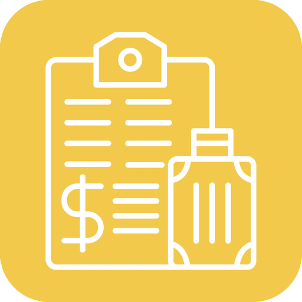

# Reisekosten für Home Assistant

Erstellt automatisch eine Reisekostenabrechnung (PDF) für jede Reise: Die Integration beobachtet eine `person`-Entität.
Verlässt sie die Heimzone, ist länger als die Mindestzeit (Standard: mehr als 8 Stunden) unterwegs und kommt zurück,
fragt sie auf dem Handy nach Reiseziel, Zweck, Kilometern (und ggf. Übernachtung/Mahlzeiten) und erzeugt die PDF.

## Installation
1. Ordner `custom_components/reisekosten` nach `<config>/custom_components/` kopieren und Home Assistant neu starten.
2. Einstellungen → Geräte & Dienste → Integration hinzufügen → **Reisekosten**.
3. Pauschalen, Kürzungen, km-Sätze und Konten unter *Konfigurieren* anpassen (Standard: Deutschland 2026).

PDFs liegen standardmäßig unter `<config>/www/reisekosten/` (abrufbar über `/local/reisekosten/<datei>`).
In den Optionen kann ein anderer **Speicherort** gewählt werden (z. B. `/media/reisekosten` oder `/share/Reisekosten`). Der Speicherort ist in den Optionen ein Dropdown (Standard, `/media`, `/share`, deren Unterordner, erlaubte Ordner) – eigene Pfade lassen sich eintippen.
Optional wird die PDF zusätzlich in den App-Ordner der Home-Assistant-OneDrive-Integration (Unterordner `Reisekosten`) hochgeladen; das nutzt die vorhandene OneDrive-Anmeldung.
Nur Ordner unterhalb von `www` bekommen einen Link in der Benachrichtigung, sonst wird der Pfad angezeigt.

## Kalender
In den Grunddaten können ein oder mehrere Kalender gewählt werden. Nach einer Reise sucht die Integration den Termin mit der größten Überschneidung und schlägt Ziel (Ort, sonst Titel) und Zweck (Titel) vor; auf dem Handy genügt ein Tipp auf „Übernehmen“.

## Einstellungen
Optionen → *Grunddaten* (Person, Zone, Handy, Name/Firma/Adresse, Kalender, Speicherort, OneDrive) und *Rechtliche Vorgaben und Konten*. Ein Gerätewechsel ist dort ohne Neueinrichtung möglich.

## Dienste
- `reisekosten.add_trip` – Reise manuell anlegen (`start`, `end`; nicht angegebene Felder werden per Handy-Rückfrage erfragt)
- `reisekosten.answer` – Rückfrage ohne Handy beantworten

## Hinweise
- Keine Steuerberatung. Pauschalen und Konten bitte mit dem Steuerberater abstimmen.
- Nicht umgesetzt: Dreimonatsfrist, Ausland, Belege/tatsächliche Übernachtungskosten, zweite Zone (Betriebsstätte).

## Entwicklung
`python3 -m unittest discover -s tests` · `python3 demo.py` erzeugt eine Beispiel-PDF.
